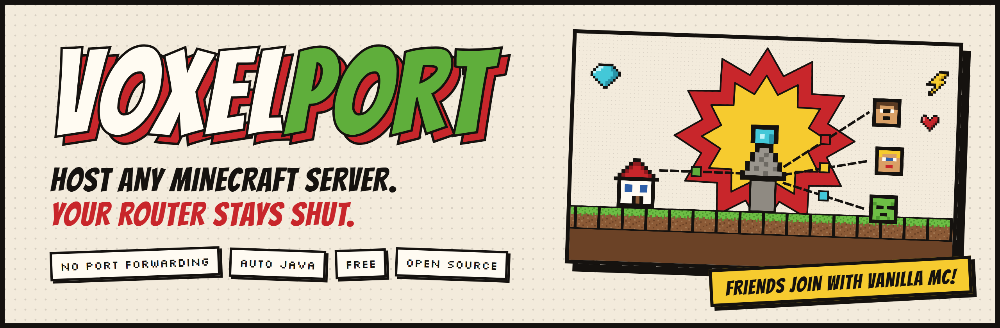
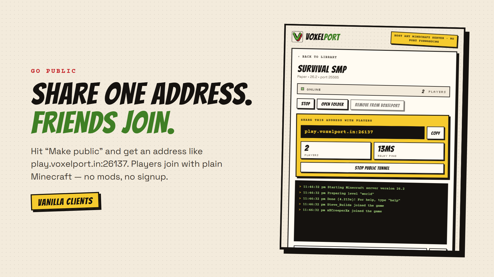
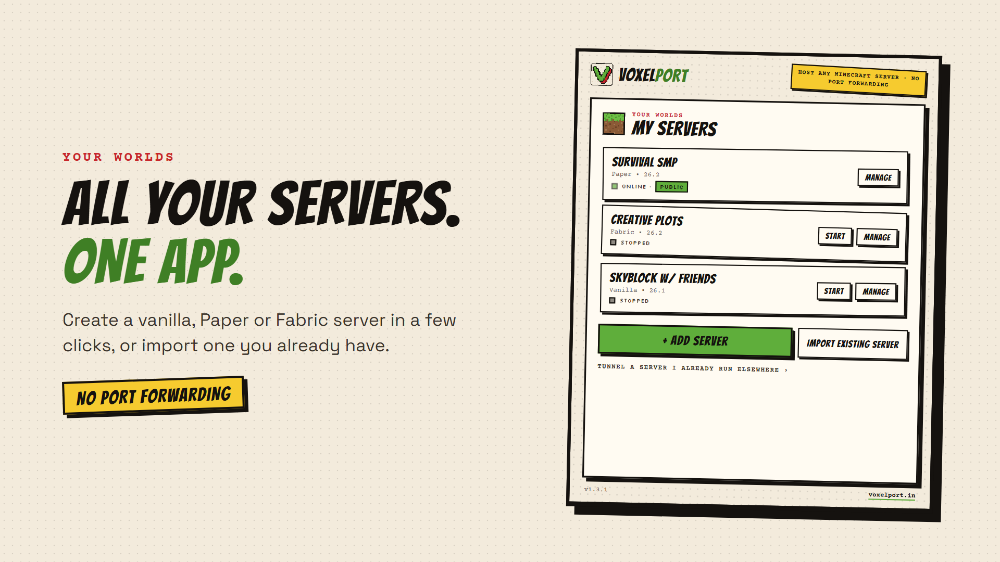
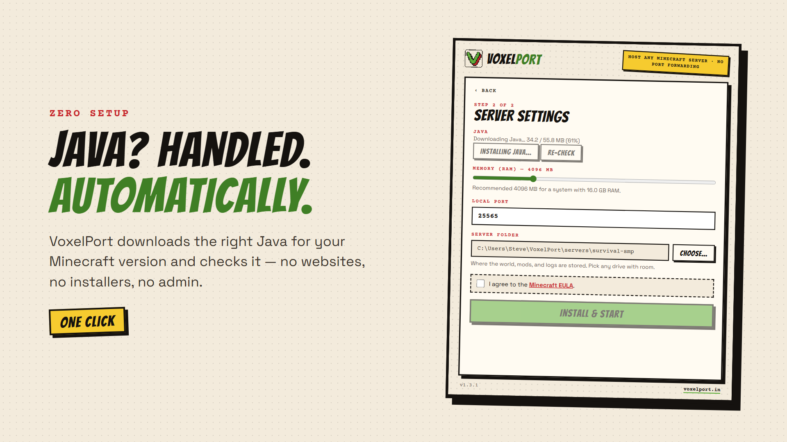
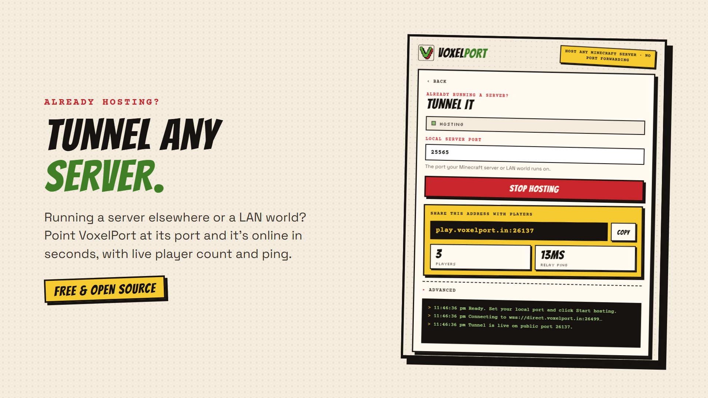

<p align="center">
  
</p>

<p align="center">
  <a href="https://github.com/VOXELPORT/VoxelPort-App/releases/latest"></a>
  <a href="https://github.com/VOXELPORT/VoxelPort-App/releases"></a>
  <a href="https://voxelport.in/#/status"></a>
  <a href="LICENSE"></a>
</p>

<h3 align="center">
  Host a Minecraft server from your PC. Friends join with plain Minecraft.<br />
  No port forwarding · no signup · no Discord.
</h3>

<p align="center">
  <a href="https://apps.microsoft.com/detail/9NGRX9CFNBD6"></a>
</p>

<p align="center">
  <a href="https://github.com/VOXELPORT/VoxelPort-App/releases/latest/download/VoxelPort-Linux.tar.gz"></a>
</p>

<p align="center"><sub>macOS coming soon · <a href="https://voxelport.in">voxelport.in</a></sub></p>

---

## ⚡ Zero to online in four steps

| | |
|:-:|---|
| **1** | **Install** the app from the [Microsoft Store](https://apps.microsoft.com/detail/9NGRX9CFNBD6) — no account needed. |
| **2** | **Create** a new server (Vanilla, Paper or Fabric) or **import** one you already have. |
| **3** | Press **Start**, then **Make public**. You get an address like `play.voxelport.in:26137`. |
| **4** | Friends paste it into **Multiplayer → Add Server**. Done. |

## 📸 Screenshots

<table>
  <tr>
    <td width="50%"></td>
    <td width="50%"></td>
  </tr>
  <tr>
    <td align="center"><b>Live console</b> — share the address, watch players join, see your ping.</td>
    <td align="center"><b>Your servers</b> — keep as many as you like, start any with one click.</td>
  </tr>
  <tr>
    <td></td>
    <td></td>
  </tr>
  <tr>
    <td align="center"><b>Java handled for you</b> — the right version, installed in seconds.</td>
    <td align="center"><b>Bring your own</b> — tunnel any server that's already running.</td>
  </tr>
</table>

## ✨ What you get

- 🌍 **No port forwarding** — the app dials out to the relay; your router and home IP stay private.
- 🏷️ **Your own address** — claim `yourname.voxelport.in` for free. Friends join without a port number.
- 📱 **Bedrock players too** — one switch installs Geyser + Floodgate so phone, console and Windows players join the same server.
- 🎮 **Vanilla clients** — Java players need nothing but Minecraft.
- 🧩 **Templates** — Survival SMP, Java + Bedrock, Creative Flat, Hardcore, Peaceful, Modded — pick one and go.
- ⚙️ **Settings screen** — game mode, difficulty, max players, whitelist, MOTD, view distance and more, without editing files.
- 📊 **Performance panel** — live CPU, RAM and TPS, with a warning when the server can't keep up.
- 🩺 **Crash explanations** — if the server stops, VoxelPort says why in plain words (port in use, missing mod, out of memory…) and offers the fix.
- 🌐 **Server list** — optionally show your server on [voxelport.in/servers](https://voxelport.in/#/servers).
- ☕ **Automatic Java** — installs the correct Eclipse Temurin (Java 25 for Minecraft 26.1+) and fixes "needs a newer Java" errors on its own.
- 📦 **Any server** — Vanilla, Paper, Fabric, modpacks, or any server jar you already have.
- 🚀 **Low ping** — connects straight to the relay, with an automatic Cloudflare fallback if your network blocks it.
- 🔒 **No account** — a private device key is created on first run and encrypted on your PC.
- 💚 **Free & open source** — MIT-licensed, like the [relay](https://github.com/VOXELPORT/relay).

## ❓ FAQ

<details>
<summary><b>Do my friends need VoxelPort?</b></summary>

No. They join with normal Minecraft: Java Edition using the address the app gives you.
</details>

<details>
<summary><b>Does it update itself?</b></summary>

Yes on Windows — the Microsoft Store keeps VoxelPort up to date for you. On Linux, download the new release when one comes out.
</details>

<details>
<summary><b>Where are my worlds stored?</b></summary>

On your PC, in the folder you choose for each server. The relay only forwards traffic — it never stores your world or player data.
</details>

## 🛠️ For developers

```bash
npm install
npm start      # run the app
npm test       # 80 tests
```

Architecture, code layout, packaging and releases: **[DEVELOPMENT.md](DEVELOPMENT.md)** · Security model: **[SECURITY.md](SECURITY.md)**

---

<p align="center">
  <sub>Not affiliated with Mojang or Microsoft. Minecraft is a trademark of Mojang AB.<br />Made by <a href="https://github.com/trazhub">trazhub</a> · <a href="https://voxelport.in">voxelport.in</a></sub>
</p>
